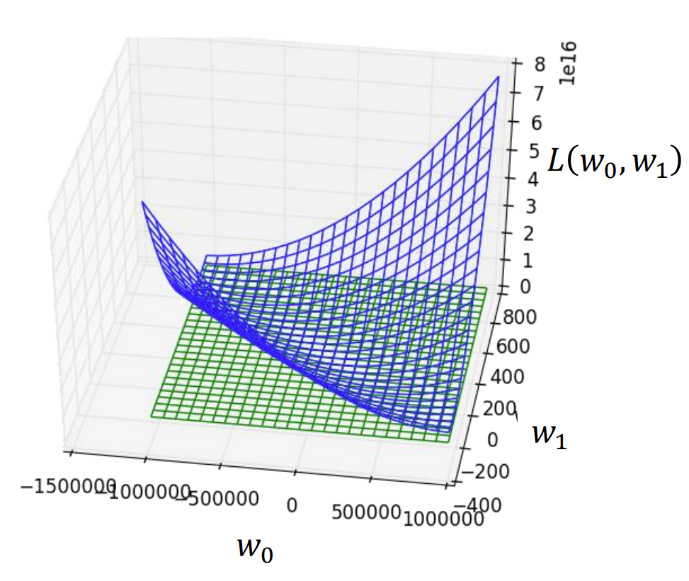
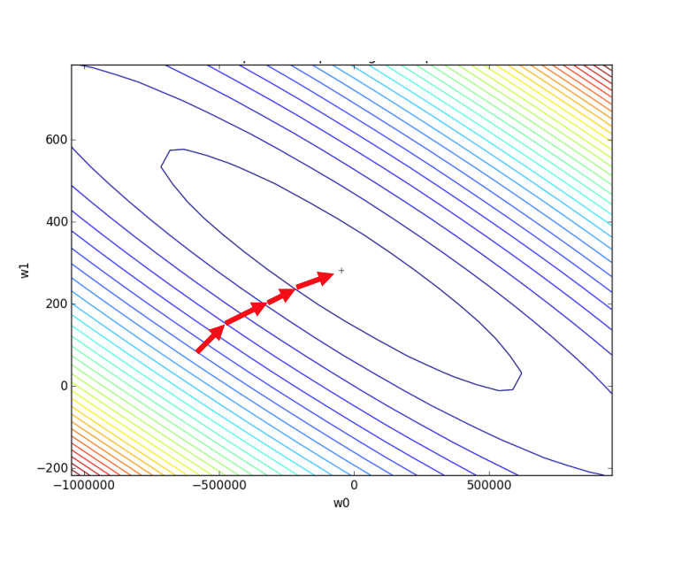
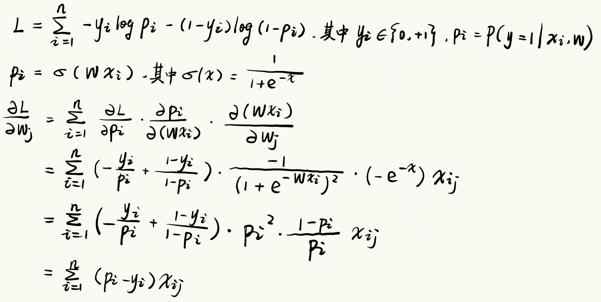

## Lec 2 : Regression

> 所有的模型都是错误的，但有用。 

### 回归：Linear Regression 线性回归 

**评估函数的拟合程度时，为什么不使用预测值和实际值之差的绝对值，而是差的平方？**  
1. 使用平方能够有效惩罚偏差大的样本 
2. 二次函数连续可导的，而绝对值则在x=0不可导 

**使用Sum-squared error (SSE) 作为损失函数，以 $y = w x + b$ 为例，实际上就是二元函数的最小值。**

使用SSE的线性回归一定有最小值，但不一定唯一。

### Gradient Descent 梯度下降

**Modeling Recipe:**
- pick model
- pick loss
- fit model by running gradient descent

### 分类：Logistic Regression 逻辑回归

例子：**大众点评**评分系统
- Input: 一段评论
- Output: 好评/差评
1. 使用train data为每个词语训练出一个权重
2. 对句子进行评分
3. 设计 **Decision Boundaries** 决策边界，如score > 0 为好评

以上完成了“硬分类”问题，但"软分类"即对分类结果有多大把握呢？
将score映射到0到1区间，作为可信度。

**如何评估预测的准确程度？**
定义Loss为预测的概率和实际结果的差别。
例如在二分类问题中，$L(p,y) = -y\log p-(1-y)\log (1-p)$

**Cross Entropy 作为 Loss 时的梯度下降：**

因此，以Cross Entropy作为Loss函数的Model在训练时，会向着缩小预测概率与实际结果误差的方向修改参数。

### 多分类问题中的Cross-Entropy Loss

在二分类问题中，由于只需要输出预测其中一个类别的概率，交叉熵为
$$
L = -\frac{1}{N}\sum_{i=1}^{N}
\left[
y_i \log(\hat{y}_i) + (1-y_i)\log(1-\hat{y}_i)
\right]
$$
而在多分类问题中，需要输出每个类别的概率，此时交叉熵为
$$
L = -\frac{1}{N} \sum_{i=1}^{N} \sum_{k=1}^{K} y_{ik}\log(p_{ik})
$$
通常将标签看作 **One-Hot Vector** 独热向量，因此在上面的式子中每个样本只有一个非零项。